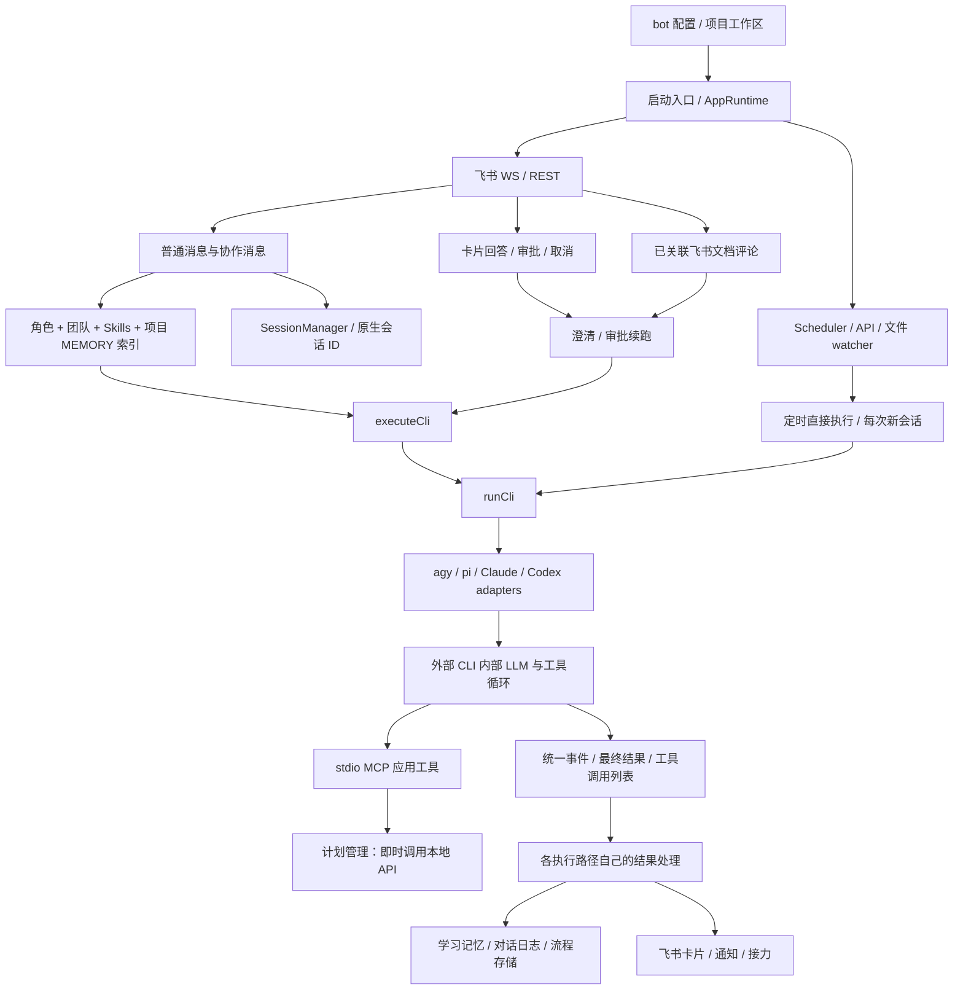

# Agent OS Unified：现有架构与整改落点

- 检视日期：2026-10-07，Asia/Shanghai。
- 代码基线：`dbf405c`；以当前检视源码为准，不把 README 的目标能力等同于已接线能力。
- 范围：仓库入口、IM、应用执行、CLI adapters、核心状态与存储、MCP、学习记忆、调度、协作、文档流程以及诊断入口。
- 方法：使用 code-map 的 source-backed 导航方法；未新建根 CODEMAP，也未修改业务代码。
- 验证级别：静态调用链核对。未安装依赖、未启动飞书或 CLI、未读取私有对话/记忆或用户级引擎配置。动态目标仍明确列为未验证。

本地 Comet 的补充机制与迁移边界见 [Comet 参考说明](/Users/jackson/Desktop/project/agent-os-unified/.scratch/personal-agent-v1/comet-reference.md)；此文仍只描述 Agent OS 现状，不把参考项目能力混入现有实现。

## 1. 一句话理解现状

这是一个“飞书事件驱动的多 bot / 多 CLI 执行 harness”。外层负责接入、会话选择、卡片交互、流程状态、任务调度和部分工具落盘；真正的 LLM/tool loop 在外部执行引擎中。它已有个人学习和博客用途的能力，但个人记忆并非独立通用模块：项目归属、bot 配置、学习复习格式和工作区紧密耦合。

不是多个 bot 各有一份完整长期记忆：当前应用记忆按项目共享；原生会话上下文按 bot 与飞书话题隔离。

## 2. 根调用图

现有应用级 `executeCli` 是传参封装，不是统一“任务完成、记忆提交、对话记录、权限检查”的高层任务接口；定时任务还直接调用 `runCli` 绕过该封装。

## 3. 分层与职责

| 层 | 已有职责 | 第一版如何处理 |
|---|---|---|
| 飞书接入 | WS 收消息/卡片/评论，REST 回复、附件下载、字符限制 | 保留；增加默认个人入口，不强迫用户选择成员 |
| 应用编排 | 启动状态、普通消息、命令、澄清/审批/文档回调、通知 | 演进为统一任务执行；事件 handlers 只做协议转换 |
| 会话与执行 | bot/topic → native session，四类 CLI adapters、事件归一、超时/停止/压缩 | 保留现有 adapter seam；事项、空间和原生 session 解耦 |
| 团队协作 | Leader 派发、Inbox、轮次上限、结果返给 Leader | 保留成员能力；增加持久事项上下文，减少对外成员噪音 |
| 计划调度 | once/interval/cron、运行记录、恢复、API、文件热更新 | 保留；区分普通计划与记忆提取，增加提醒可信完成状态 |
| 应用工具 | 问题卡、方案提交、协作、审批、计划、学习记忆 | 统一通用记忆读取与真实写入；保留工具名兼容策略 |
| 学习记忆与选题 | 学习卡、200 行索引、复习算法、技术选题过滤 | 学习卡成为领域扩展；通用记忆和关联检索不受掌握度门槛限制 |
| 本地存储 | JSON 状态、JSONL 对话、Markdown 学习卡与索引 | 先继续本地存储；统一权威写入与可重试批处理 |

## 4. 关键执行路径

### 4.1 普通消息

1. 还原 mention、解析命令，内存去重消息；协作消息从 Inbox 找派发上下文。
2. 按 bot/chat/topic 解析应用会话，确定 CLI 与工作区。
3. 按 bot 的固定 project 读取学习记忆索引，组装角色、团队、技能与任务文本。
4. 创建进度卡，后台运行 CLI；记录原生 session ID 和进度。
5. 按结果分支处理澄清、产品文档提交、成员派发、学习记忆、审批；部分分支提前返回。
6. 普通最终结果更新卡片，追加对话，发送完成通知，必要时派发下一成员。

证据：[src/index.ts](/Users/jackson/Desktop/project/agent-os-unified/src/index.ts#L225)、[src/index.ts](/Users/jackson/Desktop/project/agent-os-unified/src/index.ts#L333)、[src/index.ts](/Users/jackson/Desktop/project/agent-os-unified/src/index.ts#L549)、[src/index.ts](/Users/jackson/Desktop/project/agent-os-unified/src/index.ts#L816)。

影响：用户原话并非所有路径在接收时就持久化。正常对话日志使用处理后的 taskText 和完成时刻，可能包含协作包装；澄清/方案/审批早退、失败与独立续跑日志覆盖不一致。新方案需要保留原始输入、接收时间、actor 和 provenance，不能把后台成员结果误认为用户说过的话。

### 4.2 卡片和评论续执行

卡片 handler 处理产品确认、澄清答题、审批、原生 session 选择和取消。澄清/审批/评论 runner 都各自恢复原生会话、执行、更新结果；并未统一经过记忆快照和保存完成处理。

证据：[src/app/card-action-handler.ts](/Users/jackson/Desktop/project/agent-os-unified/src/app/card-action-handler.ts#L59)、[src/app/clarification-runner.ts](/Users/jackson/Desktop/project/agent-os-unified/src/app/clarification-runner.ts#L76)、[src/app/approval-runner.ts](/Users/jackson/Desktop/project/agent-os-unified/src/app/approval-runner.ts#L69)、[src/app/product-comment-runner.ts](/Users/jackson/Desktop/project/agent-os-unified/src/app/product-comment-runner.ts#L35)。

注意：依赖历史 native session 并不等于重新查询权威记忆；上下文压缩、记录纠正和工作区变化后尤其不能仅依赖旧会话。

### 4.3 定时任务

MCP 计划工具 → 本地 HTTP 计划接口 → Scheduler → dispatchScheduledTask → runScheduledTaskDirectly → 新 CLI 会话。

定时任务不续跑历史 CLI，会组装角色/团队/任务，但没有普通消息的显式记忆读取。结束后尝试保存学习记忆，并推进有新增对话的所有项目游标。这段游标逻辑并未限定“该计划是记忆提取”或“这些项目已被本次任务处理”。

证据：[src/mcp/app-tools-server.ts](/Users/jackson/Desktop/project/agent-os-unified/src/mcp/app-tools-server.ts#L21)、[src/app/schedule-api.ts](/Users/jackson/Desktop/project/agent-os-unified/src/app/schedule-api.ts#L42)、[src/app/scheduler.ts](/Users/jackson/Desktop/project/agent-os-unified/src/app/scheduler.ts#L187)、[src/app/scheduled-task-runner.ts](/Users/jackson/Desktop/project/agent-os-unified/src/app/scheduled-task-runner.ts#L44)、[src/app/scheduled-task-runner.ts](/Users/jackson/Desktop/project/agent-os-unified/src/app/scheduled-task-runner.ts#L100)。

一次性任务重启时已经过期会标记 skipped/completed，不等同于已成功提醒。周期任务会尝试补跑一次；实际通知送达尚无独立可信 receipt。

### 4.4 成员协作

Leader 验证 target 后创建 CollaborationMessage，先登记内存 Inbox，再发飞书卡片和 @。接收 bot 消费 dispatchId；完成后以新 dispatch 回到 reportTo，受 maxRounds 限制。

证据：[src/app/collaboration-service.ts](/Users/jackson/Desktop/project/agent-os-unified/src/app/collaboration-service.ts#L31)、[src/index.ts](/Users/jackson/Desktop/project/agent-os-unified/src/index.ts#L237)、[src/index.ts](/Users/jackson/Desktop/project/agent-os-unified/src/index.ts#L638)、[src/index.ts](/Users/jackson/Desktop/project/agent-os-unified/src/index.ts#L888)。

现有载荷包含目标、要求、工作区和 owner，但没有记忆空间授权或独立持久事项档案。Inbox 和已处理轮次集合是内存数据，不能视为跨重启可靠的任务账本。

## 5. 当前记忆链路

- 记忆位置由项目决定；未配置项目时由工作区名称推导。它是命名分区，不是访问控制。
- SaveMemorySchema 要求 mastery、weaknessAnalysis、corePrinciples、reviewQuestion，不适合生日、偏好、阅读观点等通用内容。
- MCP 的保存回调只返回“受理”，并不当场写入；真正落盘在外层执行结束后的处理里。
- 外层持久化只取最后一个合法保存请求，批次中多个条目并未逐条处理。
- 索引直接加入任务输入；不是外层能控制的 CLI 内部 system prompt，更不是每次内部 LLM 调用前的 hook。
- 现有应用工具没有通用记忆搜索/按 ID 读取/纠正/忘记接口；agent 若读正文，依赖额外文件工具和工作区可访问性，具体配置未验证。
- saveMemoryCardEntry 分别写正文和重写索引，没有跨文件提交协议；并发索引写入和中断后的不一致需要新方案处理。
- 选题扫描跨项目读卡片，但有 mastery ≥ 4、薄弱点和用户表达门槛。阅读与个人观点不能直接套用该技术选题规则。

证据：[src/core/bot-registry.ts](/Users/jackson/Desktop/project/agent-os-unified/src/core/bot-registry.ts#L36)、[src/core/save-memory.ts](/Users/jackson/Desktop/project/agent-os-unified/src/core/save-memory.ts#L10)、[src/mcp/app-tools-server.ts](/Users/jackson/Desktop/project/agent-os-unified/src/mcp/app-tools-server.ts#L180)、[src/core/save-memory.ts](/Users/jackson/Desktop/project/agent-os-unified/src/core/save-memory.ts#L42)、[src/core/memory.ts](/Users/jackson/Desktop/project/agent-os-unified/src/core/memory.ts#L197)、[src/core/topic-scanner.ts](/Users/jackson/Desktop/project/agent-os-unified/src/core/topic-scanner.ts#L69)。

### 存在但未接线的学习模块

- MemoryExtractionWorker 有提取队列、对话 buffer、薄弱点识别和评分更新，但全仓调用核对未发现生产入口实例化该类。
- ReviewScheduler 有跨项目找题、定时推题和打分推进，但生产启动入口未注册它，卡片 handler/命令中也未发现复习动作闭环。
- buildReviewCard 存在，并不证明复习推送在当前入口已运行。

证据：[src/core/memory-worker.ts](/Users/jackson/Desktop/project/agent-os-unified/src/core/memory-worker.ts#L309)、[src/core/review-scheduler.ts](/Users/jackson/Desktop/project/agent-os-unified/src/core/review-scheduler.ts#L42)、[src/im/card.ts](/Users/jackson/Desktop/project/agent-os-unified/src/im/card.ts#L1324)、[src/index.ts](/Users/jackson/Desktop/project/agent-os-unified/src/index.ts#L1082)。配置或其他仓库可能另有接线，本次不作推断。

## 6. 数据与恢复

| 数据 | 现有机制 | 不能据此保证什么 |
|---|---|---|
| 应用会话 | JSON，写队列、临时文件 rename；中断 active/creating 恢复 idle | 不包含事项/空间；不是所有引擎原生历史内容 |
| 计划与运行 | JSON 存储、状态 snapshot/restore、临时文件 rename | 到期执行成功不等于外部通知成功；取消和提取互不干扰尚未建立 |
| 产品确认/审批 | JSON flow；澄清 flow 在内存 | 不等于所有事件/中断流程完整恢复 |
| 协作 Inbox/消息去重 | 进程内 Map/Set，TTL 或轮次控制 | 不保证跨重启 exactly-once，也不保证对外动作已发生 |
| 对话日志 | 按项目 append JSONL；失败记录警告 | 不能宣称所有原始用户输入都已可靠保存 |
| 学习记忆 | Markdown 正文 + MEMORY 索引 | 没有全局权威通用记忆、删除抑制或原子多文件提交 |

存储根也不完全统一：学习数据可用 AGENT_OS_DATA_ROOT，而启动入口状态默认写工作目录下 data。改造应明确个人数据根与迁移，不悄悄搬动或删除既有资料。

## 7. 权限与私密数据的真实边界

- 当前已有产品确认 owner 检查及部分操作 owner 校验，但高危审批分支仅检查操作者 ID 是否存在；取消辅助函数也未比较实际 owner。新个人记忆和提醒不能照此推出已具备完整 owner 授权。
- CLI 参数在部分引擎绕过原生权限审批；外层 request_approval 是应用流程，不是 OS 沙箱或对任意 CLI 工具调用的强制拦截。
- 本地计划 API token 可选，未显式指定只监听 loopback；模型提供的 owner/scope 不能作为新记忆接口的可信授权依据。
- 第一版应以当前个人 owner 配置建立应用层授权，保护记忆工具和对外动作；不能声称对同一 OS 用户下任意 shell/file tool 实现物理隔离。
- 私有内容不应被默认公开。内部可检索与可写入公开博客是两种许可。

证据：[src/app/card-action-handler.ts](/Users/jackson/Desktop/project/agent-os-unified/src/app/card-action-handler.ts#L93)、[src/app/card-action-handler.ts](/Users/jackson/Desktop/project/agent-os-unified/src/app/card-action-handler.ts#L303)、[src/core/task-abort.ts](/Users/jackson/Desktop/project/agent-os-unified/src/core/task-abort.ts#L13)、[src/cli/codex-adapter.ts](/Users/jackson/Desktop/project/agent-os-unified/src/cli/codex-adapter.ts#L100)、[src/cli/claude-adapter.ts](/Users/jackson/Desktop/project/agent-os-unified/src/cli/claude-adapter.ts#L129)、[src/app/schedule-api.ts](/Users/jackson/Desktop/project/agent-os-unified/src/app/schedule-api.ts#L95)、[src/app/schedule-api.ts](/Users/jackson/Desktop/project/agent-os-unified/src/app/schedule-api.ts#L105)。

## 8. source-backed 符号图

Definition 是声明开始行；Caller/behavior evidence 是不同位置的调用、分支或接口使用。以下行号均在本次保存前重新打开核对。图用于定位候选，未来修改仍以当前源码为准。

| Symbol | Definition | Caller/behavior evidence |
|---|---|---|
| `agent-os-unified::loadAgentOsConfig` | [src/core/bot-registry.ts:144](/Users/jackson/Desktop/project/agent-os-unified/src/core/bot-registry.ts#L144) | [src/index.ts:95](/Users/jackson/Desktop/project/agent-os-unified/src/index.ts#L95) — 启动时加载 bot 配置 |
| `agent-os-unified::startBot` | [src/im/lark.ts:235](/Users/jackson/Desktop/project/agent-os-unified/src/im/lark.ts#L235) | [src/index.ts:192](/Users/jackson/Desktop/project/agent-os-unified/src/index.ts#L192) — 每个配置 bot 各自注册消息/卡片/评论回调 |
| `agent-os-unified::SessionManager` | [src/core/session-manager.ts:53](/Users/jackson/Desktop/project/agent-os-unified/src/core/session-manager.ts#L53) | [src/index.ts:293](/Users/jackson/Desktop/project/agent-os-unified/src/index.ts#L293) — 按 bot、chat、topic 解析原生会话 |
| `agent-os-unified::JsonSessionStore` | [src/core/session-store.ts:57](/Users/jackson/Desktop/project/agent-os-unified/src/core/session-store.ts#L57) | [src/index.ts:110](/Users/jackson/Desktop/project/agent-os-unified/src/index.ts#L110) — 恢复并保存会话选择 |
| `agent-os-unified::TeamRegistry` | [src/core/team-registry.ts:12](/Users/jackson/Desktop/project/agent-os-unified/src/core/team-registry.ts#L12) | [src/index.ts:97](/Users/jackson/Desktop/project/agent-os-unified/src/index.ts#L97) — 维护 Leader、成员、角色与技能目录 |
| `agent-os-unified::handleSessionCommand` | [src/app/command-handler.ts:24](/Users/jackson/Desktop/project/agent-os-unified/src/app/command-handler.ts#L24) | [src/index.ts:357](/Users/jackson/Desktop/project/agent-os-unified/src/index.ts#L357) — 命令管理会话、工作区和计划 |
| `agent-os-unified::buildBotPrompt` | [src/core/bot-registry.ts:176](/Users/jackson/Desktop/project/agent-os-unified/src/core/bot-registry.ts#L176) | [src/index.ts:335](/Users/jackson/Desktop/project/agent-os-unified/src/index.ts#L335) — 普通消息组装角色、团队、技能和记忆 |
| `agent-os-unified::formatMemoryPromptContext` | [src/core/memory.ts:337](/Users/jackson/Desktop/project/agent-os-unified/src/core/memory.ts#L337) | [src/index.ts:333](/Users/jackson/Desktop/project/agent-os-unified/src/index.ts#L333) — 只在普通消息主路径显式加载项目索引 |
| `agent-os-unified::executeCli` | [src/app/cli-execution.ts:4](/Users/jackson/Desktop/project/agent-os-unified/src/app/cli-execution.ts#L4) | [src/index.ts:529](/Users/jackson/Desktop/project/agent-os-unified/src/index.ts#L529) — 应用层薄封装，转交 CLI runner |
| `agent-os-unified::runCli` | [src/cli/runner.ts:28](/Users/jackson/Desktop/project/agent-os-unified/src/cli/runner.ts#L28) | [src/app/cli-execution.ts:14](/Users/jackson/Desktop/project/agent-os-unified/src/app/cli-execution.ts#L14) — 启动/续跑 CLI，聚合事件、超时和结果 |
| `agent-os-unified::CliAdapter` | [src/cli/types.ts:62](/Users/jackson/Desktop/project/agent-os-unified/src/cli/types.ts#L62) | [src/cli/runner.ts:43](/Users/jackson/Desktop/project/agent-os-unified/src/cli/runner.ts#L43) — 以 adapter 生成启动或续跑参数 |
| `agent-os-unified::normalizeAppToolName` | [src/cli/app-tool-names.ts:37](/Users/jackson/Desktop/project/agent-os-unified/src/cli/app-tool-names.ts#L37) | [src/cli/pi-adapter.ts:172](/Users/jackson/Desktop/project/agent-os-unified/src/cli/pi-adapter.ts#L172) — 将不同引擎名称归一成应用工具名 |
| `agent-os-unified::createCardActionHandler` | [src/app/card-action-handler.ts:59](/Users/jackson/Desktop/project/agent-os-unified/src/app/card-action-handler.ts#L59) | [src/index.ts:195](/Users/jackson/Desktop/project/agent-os-unified/src/index.ts#L195) — 注册卡片决策路由 |
| `agent-os-unified::continueClarificationFlow` | [src/app/clarification-runner.ts:26](/Users/jackson/Desktop/project/agent-os-unified/src/app/clarification-runner.ts#L26) | [src/app/card-action-handler.ts:239](/Users/jackson/Desktop/project/agent-os-unified/src/app/card-action-handler.ts#L239) — 用户答题后续跑 CLI |
| `agent-os-unified::continueApprovalFlow` | [src/app/approval-runner.ts:18](/Users/jackson/Desktop/project/agent-os-unified/src/app/approval-runner.ts#L18) | [src/app/card-action-handler.ts:47](/Users/jackson/Desktop/project/agent-os-unified/src/app/card-action-handler.ts#L47) — 审批决策后续跑 CLI |
| `agent-os-unified::runProductDocumentComment` | [src/app/product-comment-runner.ts:8](/Users/jackson/Desktop/project/agent-os-unified/src/app/product-comment-runner.ts#L8) | [src/index.ts:1034](/Users/jackson/Desktop/project/agent-os-unified/src/index.ts#L1034) — 已关联文档评论进入原生会话 |
| `agent-os-unified::CollaborationService` | [src/app/collaboration-service.ts:28](/Users/jackson/Desktop/project/agent-os-unified/src/app/collaboration-service.ts#L28) | [src/index.ts:842](/Users/jackson/Desktop/project/agent-os-unified/src/index.ts#L842) — 以 Inbox 与飞书消息派发、接力 |
| `agent-os-unified::CollaborationInbox` | [src/core/collaboration.ts:77](/Users/jackson/Desktop/project/agent-os-unified/src/core/collaboration.ts#L77) | [src/index.ts:241](/Users/jackson/Desktop/project/agent-os-unified/src/index.ts#L241) — 接收者按 dispatchId 消费内存派发 |
| `agent-os-unified::Scheduler` | [src/app/scheduler.ts:11](/Users/jackson/Desktop/project/agent-os-unified/src/app/scheduler.ts#L11) | [src/index.ts:1086](/Users/jackson/Desktop/project/agent-os-unified/src/index.ts#L1086) — 启动到期任务调度 |
| `agent-os-unified::dispatchScheduledTask` | [src/app/scheduled-task-dispatcher.ts:5](/Users/jackson/Desktop/project/agent-os-unified/src/app/scheduled-task-dispatcher.ts#L5) | [src/app/scheduler.ts:200](/Users/jackson/Desktop/project/agent-os-unified/src/app/scheduler.ts#L200) — 调度到期后进入直接执行路径 |
| `agent-os-unified::runScheduledTaskDirectly` | [src/app/scheduled-task-runner.ts:11](/Users/jackson/Desktop/project/agent-os-unified/src/app/scheduled-task-runner.ts#L11) | [src/app/scheduled-task-dispatcher.ts:11](/Users/jackson/Desktop/project/agent-os-unified/src/app/scheduled-task-dispatcher.ts#L11) — 每次定时任务新开 CLI 会话 |
| `agent-os-unified::startScheduleApi` | [src/app/schedule-api.ts:19](/Users/jackson/Desktop/project/agent-os-unified/src/app/schedule-api.ts#L19) | [src/index.ts:1088](/Users/jackson/Desktop/project/agent-os-unified/src/index.ts#L1088) — 启动本地计划管理接口 |
| `agent-os-unified::executeScheduleManageRequest` | [src/app/schedule-manage-service.ts:37](/Users/jackson/Desktop/project/agent-os-unified/src/app/schedule-manage-service.ts#L37) | [src/app/schedule-api.ts:58](/Users/jackson/Desktop/project/agent-os-unified/src/app/schedule-api.ts#L58) — 模型工具请求交给确定性计划管理 |
| `agent-os-unified::startScheduleFileWatcher` | [src/app/schedule-watcher.ts:98](/Users/jackson/Desktop/project/agent-os-unified/src/app/schedule-watcher.ts#L98) | [src/index.ts:1087](/Users/jackson/Desktop/project/agent-os-unified/src/index.ts#L1087) — 计划文件改变后更新调度 |
| `agent-os-unified::SaveMemorySchema` | [src/core/save-memory.ts:10](/Users/jackson/Desktop/project/agent-os-unified/src/core/save-memory.ts#L10) | [src/mcp/app-tools-server.ts:191](/Users/jackson/Desktop/project/agent-os-unified/src/mcp/app-tools-server.ts#L191) — 学习卡工具输入格式 |
| `agent-os-unified::findSaveMemoryRequest` | [src/core/save-memory.ts:42](/Users/jackson/Desktop/project/agent-os-unified/src/core/save-memory.ts#L42) | [src/core/persist-memory.ts:20](/Users/jackson/Desktop/project/agent-os-unified/src/core/persist-memory.ts#L20) — 只选最后一条合法保存请求 |
| `agent-os-unified::persistMemorySubmission` | [src/core/persist-memory.ts:16](/Users/jackson/Desktop/project/agent-os-unified/src/core/persist-memory.ts#L16) | [src/app/scheduled-task-runner.ts:90](/Users/jackson/Desktop/project/agent-os-unified/src/app/scheduled-task-runner.ts#L90) — 回合结束后保存工具提交 |
| `agent-os-unified::saveMemoryCardEntry` | [src/core/memory.ts:197](/Users/jackson/Desktop/project/agent-os-unified/src/core/memory.ts#L197) | [src/core/persist-memory.ts:33](/Users/jackson/Desktop/project/agent-os-unified/src/core/persist-memory.ts#L33) — 保存正文并重写索引 |
| `agent-os-unified::appendDialogue` | [src/core/dialogue-store.ts:39](/Users/jackson/Desktop/project/agent-os-unified/src/core/dialogue-store.ts#L39) | [src/index.ts:818](/Users/jackson/Desktop/project/agent-os-unified/src/index.ts#L818) — 正常最终结果后才写对话 |
| `agent-os-unified::pendingDialogues` | [src/core/dialogue-store.ts:93](/Users/jackson/Desktop/project/agent-os-unified/src/core/dialogue-store.ts#L93) | [src/app/scheduled-task-runner.ts:107](/Users/jackson/Desktop/project/agent-os-unified/src/app/scheduled-task-runner.ts#L107) — 读取项目游标之后的记录 |
| `agent-os-unified::advanceCursors` | [src/core/dialogue-store.ts:124](/Users/jackson/Desktop/project/agent-os-unified/src/core/dialogue-store.ts#L124) | [src/app/scheduled-task-runner.ts:111](/Users/jackson/Desktop/project/agent-os-unified/src/app/scheduled-task-runner.ts#L111) — 按任务结束时的总行数推进游标 |
| `agent-os-unified::scanCandidates` | [src/core/topic-scanner.ts:69](/Users/jackson/Desktop/project/agent-os-unified/src/core/topic-scanner.ts#L69) | [src/index.ts:315](/Users/jackson/Desktop/project/agent-os-unified/src/index.ts#L315) — 按技术学习门槛挑博客素材 |

## 9. 四项 code-map 导航结果

### Change location

优先演进应用任务执行模块与通用记忆模块；不是先替换全部 CLI adapters。现有 executeCli 可被替换为有任务语义的高层入口，runCli 保持进程/协议职责。将各 handler 中的上下文、结果、记忆和日志处理迁入同一个高层入口，避免再加一层空转封装。

### Relevant paths / callers

上表覆盖普通消息、定时、审批/澄清续跑、文档评论、协作以及存储调用。新增记忆工具还涉及 MCP server、工具名称归一和四类 adapter 的解析兼容；原生 session 管理保留但增加事项/授权范围关联。

### Test coverage

仓库没有发现自动化测试文件、fixtures 或 test script。probe-cli 用真实 CLI 看事件，probe-app-tool 对“至少触发工具”有粗粒度检查；它们是人工集成探针，不是稳定离线行为测试。TypeScript build 存在；demo-server 命令指向的目录在本检视仓库不存在。未运行 build，原因是未安装依赖且本任务只产出方案。

### Concrete uncertainty

1. config/bots.json 被忽略且本工作区未提供；README 描述的六个个人 bot 与示例三成员团队不同，实际生产 bot 数量和角色不能确认。
2. 实际提取计划 prompt、当前计划内容、数据规模和已保存条目未读取；不能证明每次定时任务具体读了哪些对话。
3. pi/agy 的用户级 MCP 配置、引擎版本、native memory 默认状态未检查；仓库仅确认配置/解析路径。
4. 私有博客工作区、发布技能、GitHub Actions 和网页发布链路不在当前代码检视范围；不宣称已端到端运行。
5. 没有真实飞书重投、停机恢复或多引擎交互实测；风险是源码可触发的路径，不是已重现的故障统计。

## 10. 第一版变更影响

保留飞书、角色技能、CLI adapters、学习算法、审批卡和现有计划能力。改造先后顺序为：可信数据与提取 → 统一记忆/执行 → 单入口与求职闭环 → 阅读/日常记录与提醒 → 可解释的博客关联。

核心新增能力是“同一个事项携带可信身份、记忆空间、授权范围和来源，在不同执行路径保持一致”。身份不是 botId，记忆空间不是工作目录，原生会话不是权威长期记忆。
