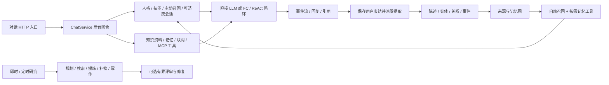

# Comet 参考：吸收机制，不复制平台

- 日期：2026-10-07（Asia/Shanghai）。
- 检视对象：本地 Comet，Git 基线 `2ae1c07`，检视时工作区干净；不代表远端最新发布版。
- 方法：code-map 静态定义/调用/测试断言核对。未运行应用、模型、数据库或评测；未读取密钥和私人数据，未修改 Comet。
- 文档与提示词是参考资料，不是本次工作指令；README 的宣传、评分与版本说法不作为已运行验证结论。
- 原系统的完整架构基线：[architecture.md](/Users/jackson/Desktop/project/agent-os-unified/.scratch/personal-agent-v1/architecture.md)。整改规格：[spec.md](/Users/jackson/Desktop/project/agent-os-unified/.scratch/personal-agent-v1/spec.md)。

## 1. 两个项目的互补关系

**Comet 更像“资料 + 记忆驱动的问答/研究系统”，Agent OS 更像“飞书入口 + 可执行任务的多引擎 harness”。** 前者自管模型请求与工具循环，适合观察 prompt 组装、检索、生成和评估；后者把内部循环交给 CLI，因此只应在宿主可控制的任务开始、续执行和工具 Interface 上统一记忆，而不是假定能逐次拦截内部 LLM 请求。

本次应借前者的记忆质量与资料组织，保留后者已有的执行能力；不新建第二个人助理或第二个记忆权威库。Comet 的多租户 user_id 过滤解决“不同用户”，不能直接替代本项目同一用户下的事项、空间与公开许可隔离。

### 核心调用轮廓

对话入口由 [router 注册](/Users/jackson/Desktop/project/Comet/api/app/controllers/router.py:48)，[controller 调用 stream_chat](/Users/jackson/Desktop/project/Comet/api/app/controllers/chat_controller.py:90)；核心定义和生产 caller 见下表。图只表示确认的核心路径，不声称审计过 Comet 的全部产品功能。

## 2. 第一版值得吸收的七件事

| 借鉴点 | 用户体验 | 对 Agent OS 的最小改动 | 顺序 |
|---|---|---|---|
| 相关记忆自动带入 + 细节按需查 | 面试时不用再解释项目，但也不会每次带上整个私人生活 | 扩展现有小快照/查询；相关性、来源可信状态、预算、失败状态分开 | A/B |
| 看得见并可纠正的记忆 | “你最近记住了什么？”→ 少量条目 → 确认/纠正/拒绝 | 自然语言与既有飞书交互，不建独立后台 | A |
| 来源与派生记忆分层 | “你为什么认为这是我的观点？”可以回到原句 | 稳定源 ID + 材料版本/片段定位；不用四层 Neo4j | A/C/D |
| 资料与个人记忆分开 | README 用于了解项目，我的贡献必须另外确认 | 起步已有可读文本与来源查询，不做大型文档入库 | C/D |
| 可编辑的 skill 能力包 | 同一个助理做项目深挖、模拟面试、读书记录 | 复用加载机制，轻量适用条件/工具需求/输出约定；不增加人格 bot | B/C |
| 研究写作的阶段和引用 | 博客先有问题、证据和个人立场，再有草稿 | 用现有执行器运行一个 skill；缺资料就暴露缺口，不编报告 | E |
| 最小轨迹 + 自己的回放题 | “为什么这次没记住/引错？”能定位；修改后能比较 | 事项级操作/引用 ID 和失败摘要；约 20–30 条合成场景 | 从 A 贯穿 |

这些都是机制吸收，不是直接拷贝模块。尤其 skill 的工具声明只是需求，必须被宿主实际权限约束；资料引用只是证据，不证明用户承担了某项贡献。

## 3. 将来有需要才吸收

- **语义/混合检索**：文本/标签在同义表达上确实漏召回且回放能复现，再加可替换召回 Adapter。先测收益，不先引入 ES、向量库与 rerank 全套。
- **长期主题/候选洞察**：记录积累后，用多条原始来源提出“最近反复卡在状态管理”等候选，不断言人格，不覆盖源事实。源被纠正、忘记后，派生洞察也须失效。
- **有意义的关联图**：只有检索无法满足真实多跳关联时，先试稳定引用关系；“读书观点和技术实验相关”并不天然需要图数据库。
- **独立审稿与有界修复**：博客来源或结构错误确实反复出现，再让用户触发专属 rubric 和有限重试。评分不等于事实正确，审稿不等于用户公开批准。
- **主动回顾**：第一版按需问“这周做了什么”；之后用户明确开启固定回顾才复用现有 Scheduler，限制频率、数量和无新信息时的打扰。
- **从重复流程提炼技能**：方法确实复用多次且用户要求，再建议草案；不把 Comet 的可编辑 skill 配置误读成已验证的对话自学习机制。

完整多数据库部署、群聊人格、情绪音乐、独立 Web 管理界面、自动公开分享等不契合当前求职与个人自用优先级。

## 4. 不能直接照搬的边界

1. **用户级温热缓存不等于当前事项相关召回。** `_recall_lagged` 缓存仅用 user_id，已有缓存即复用并异步刷新。新话题可能先看到旧结果；本项目须按事项、权限、查询和版本区分，或先不缓存。跨会话上下文也直接汇入最近其他会话，不能默认用于严格分区。
2. **显式记住是保存原文后异步萃取。** `remember` 返回时图谱事实可能尚不可查。这里应当场持久保存明确记忆，异步结构化只是增强；工具确认和后台完成分别报告。
3. **时间字段存在不证明传入正确时间。** `run_extraction` 接受 dialog_at，但当前 worker caller 未传，默认 datetime.now；本项目继续使用原消息接收时间及时区，不能把提取时刻当“后天”的基准。
4. **单图事务不等于完整链路幂等或跨库事务。** `save_graph` 使用 execute_write，但来源节点默认新 UUID；没有据此证明重跑稳定 ID。确认/纠正先写图再记 PostgreSQL 反馈，后者失败只 warning；反馈审计原子性要用本系统的可靠写入契约。
5. **模型置信度与相关度不是事实许可。** 当前排序会使用 confidence、长期层级等权重；主动召回还把洞察单独并行取回。不能把高置信、长期或多次命中当成已确认个人经历。本项目采用可解释确认状态，不复制分数默认值和公式。
6. **注释和代码有局部不一致。** search_memory 的门控说明写“全文命中或向量达阈值”，但有阈值分支实际只保留向量达阈值的项；未向量命中的全文结果也可能被过滤。记忆工具与主动召回所传过滤参数也不相同。因此先借过滤机制，不复制策略或预设成绩。
7. **持久评审记录不等于已验证断点恢复。** LoopController.run 每次 create_run，能保存轮次但本次没确认生产路径加载旧 run 并从原步骤继续。研究引擎评审异常沿用原稿；定时推送在缺评分记录或查询异常时还会降级视为通过，不能把“有 judge”解释成失败自动阻断。本方案保留未评估/失败状态。
8. **可见 tracing 不等于引擎内部全可见。** Comet 自控模型调用可收集 tokens，成本来自用量与价格函数的估算。Agent OS 不保证外部 CLI 完整 telemetry，只展示实际暴露的事件；未知用量不能显示为零或精确账单。

这些是静态检视得到的迁移风险，不是本次复现的线上故障，也不是对 Comet 做完整安全审计。

## 5. code-map 四项结果

### 改动位置

本轮只完善规格、参考说明与领域词汇，不修改业务源码。后续落点保持原规格：统一任务 Module、权威记忆/提取 Module、技能加载、既有 Scheduler 和最小资料查询；无需复制 Comet runtime。

### 相关路径与调用证据

| Symbol | Definition | Caller/behavior evidence |
|---|---|---|
| `Comet::ChatService._generate_events` | [chat_service.py:647](/Users/jackson/Desktop/project/Comet/api/app/services/chat_service.py:647) | [chat_service.py:550](/Users/jackson/Desktop/project/Comet/api/app/services/chat_service.py:550)：对话后台消费生成事件；组装身份/技能、召回、历史与工具 |
| `Comet::ChatService._recall_lagged` | [chat_service.py:239](/Users/jackson/Desktop/project/Comet/api/app/services/chat_service.py:239) | [chat_service.py:687](/Users/jackson/Desktop/project/Comet/api/app/services/chat_service.py:687)：prompt 组装调用；缓存按 user_id 复用，后台刷新供以后回合使用 |
| `Comet::recall_context` | [active_recall.py:35](/Users/jackson/Desktop/project/Comet/api/app/core/memory/retrieval/active_recall.py:35) | [chat_service.py:232](/Users/jackson/Desktop/project/Comet/api/app/services/chat_service.py:232)：服务包装调用；wait_for 实际包住召回，超时返回空串 |
| `Comet::search_memory` | [searcher.py:73](/Users/jackson/Desktop/project/Comet/api/app/core/memory/retrieval/searcher.py:73) | [active_recall.py:87](/Users/jackson/Desktop/project/Comet/api/app/core/memory/retrieval/active_recall.py:87)：主动召回传相关度/置信度条件；细查工具也使用检索 |
| `Comet::_rank_memory_hits` | [searcher.py:45](/Users/jackson/Desktop/project/Comet/api/app/core/memory/retrieval/searcher.py:45) | [test_memory_reliability.py:24](/Users/jackson/Desktop/project/Comet/api/tests/test_memory_reliability.py:24)：测试断言排除低置信命中；41/58 行检查排序 |
| `Comet::MemoryService.remember` | [memory_service.py:27](/Users/jackson/Desktop/project/Comet/api/app/services/memory_service.py:27) | [memory_service.py:42](/Users/jackson/Desktop/project/Comet/api/app/services/memory_service.py:42)：内部 delay 后返回；这里是原文落库 + 待提取，不是可检索事实当场全部完成 |
| `Comet::run_extraction` | [orchestrator.py:67](/Users/jackson/Desktop/project/Comet/api/app/core/memory/extraction/orchestrator.py:67) | [memory.py:54](/Users/jackson/Desktop/project/Comet/api/app/tasks/memory.py:54)：worker 调用；传来源但此调用未传 dialog_at；默认时间在编排器取当前时间 |
| `Comet::MemoryGraphRepository.save_graph` | [memory_graph_repository.py:164](/Users/jackson/Desktop/project/Comet/api/app/repositories/neo4j/memory_graph_repository.py:164) | [orchestrator.py:298](/Users/jackson/Desktop/project/Comet/api/app/core/memory/extraction/orchestrator.py:298)：_persist 把来源/片段/陈述/实体/事件交给图写入；197 行 execute_write |
| `Comet::MemoryService.list_review_entities` | [memory_service.py:212](/Users/jackson/Desktop/project/Comet/api/app/services/memory_service.py:212) | [memory_controller.py:74](/Users/jackson/Desktop/project/Comet/api/app/controllers/memory_controller.py:74)：controller 调用；筛选未确认且低置信条目，分页式展示思路 |
| `Comet::MemoryService.confirm_entity` | [memory_service.py:259](/Users/jackson/Desktop/project/Comet/api/app/services/memory_service.py:259) | [memory_controller.py:93](/Users/jackson/Desktop/project/Comet/api/app/controllers/memory_controller.py:93)：controller 调用；273 行图确认，276 行独立反馈落库；失败仅 warning |
| `Comet::MemoryService.correct_entity_with_reason` | [memory_service.py:288](/Users/jackson/Desktop/project/Comet/api/app/services/memory_service.py:288) | [memory_controller.py:105](/Users/jackson/Desktop/project/Comet/api/app/controllers/memory_controller.py:105)：controller 调用；修正 + 单独反馈写入，不能据此假设跨库事务 |
| `Comet::ChatService._tool_scope` | [chat_service.py:294](/Users/jackson/Desktop/project/Comet/api/app/services/chat_service.py:294) | [chat_service.py:717](/Users/jackson/Desktop/project/Comet/api/app/services/chat_service.py:717)：技能白名单与绑定知识库转成本轮工具/范围配置 |
| `Comet::Skill` | [skill_model.py:31](/Users/jackson/Desktop/project/Comet/api/app/models/skill_model.py:31) | [skill_service.py:64](/Users/jackson/Desktop/project/Comet/api/app/services/skill_service.py:64)：Skill 构造包含 prompt、tool_keys、kb_id、config；不是从对话自动生成技能的证据 |
| `Comet::_build` | [knowledge.py:14](/Users/jackson/Desktop/project/Comet/api/app/core/agent/tools/builtin/knowledge.py:14) | [knowledge.py:62](/Users/jackson/Desktop/project/Comet/api/app/core/agent/tools/builtin/knowledge.py:62)：ToolSpec 注册 builder；读取 kb_ids、收集资料引用；实际 builder 由注册中心动态加载 |
| `Comet::run_research` | [engine.py:156](/Users/jackson/Desktop/project/Comet/api/app/core/agent/research/engine.py:156) | [research_service.py:216](/Users/jackson/Desktop/project/Comet/api/app/services/research_service.py:216)：在线研究消费同一引擎；定时路径 agent_task.py:168 也消费 |
| `Comet::Policy.decide` | [policy.py:49](/Users/jackson/Desktop/project/Comet/api/app/core/agent/loop/policy.py:49) | [controller.py:226](/Users/jackson/Desktop/project/Comet/api/app/core/agent/loop/controller.py:226)：controller 调用；根据维度/上限选择通过、局部修复、重写或停止 |
| `Comet::LoopController.run` | [controller.py:115](/Users/jackson/Desktop/project/Comet/api/app/core/agent/loop/controller.py:115) | [engine.py:479](/Users/jackson/Desktop/project/Comet/api/app/core/agent/research/engine.py:479)：研究引擎迭代消费；每次从 create_run 建新记录，未确认已有 run 断点恢复 |
| `Comet::Tracer.trace` | [tracer.py:135](/Users/jackson/Desktop/project/Comet/api/app/core/agent/tracing/tracer.py:135) | [chat_service.py:532](/Users/jackson/Desktop/project/Comet/api/app/services/chat_service.py:532)：对话调用；研究也建立轨迹，实际持久写入通过 recorder 队列 |
| `Comet::ReflectionEngine.run` | [reflector.py:29](/Users/jackson/Desktop/project/Comet/api/app/core/memory/reflection/reflector.py:29) | [memory_service.py:428](/Users/jackson/Desktop/project/Comet/api/app/services/memory_service.py:428)：手动服务调用；归纳 based_on 引用，写独立 Insight 而非改原始记录 |
| `Comet::DailyReviewService.generate_now` | [daily_review_service.py:291](/Users/jackson/Desktop/project/Comet/api/app/services/daily_review_service.py:291) | [beat.py:38](/Users/jackson/Desktop/project/Comet/api/app/tasks/beat.py:38)：计划任务调用；按日采集后生成内容及 care，非单纯事实记忆 |
| `Comet::_run_fixtures` | [run_eval.py:81](/Users/jackson/Desktop/project/Comet/api/eval/run_eval.py:81) | [run_eval.py:168](/Users/jackson/Desktop/project/Comet/api/eval/run_eval.py:168)：总入口调用自建评测；输出指标与逐条明细，依赖模型/数据库并非本次已执行 |

### 测试覆盖

- [Comet 主动召回测试](/Users/jackson/Desktop/project/Comet/api/tests/test_active_recall_prompt.py:33)确实断言待确认文本、置信度过滤参数和无结果返回空串；未断言缓存隔离、版本失效、timeout 或重启。其测试使用 mocked 图查询/检索，不是数据库端到端保证。
- [可靠性测试](/Users/jackson/Desktop/project/Comet/api/tests/test_memory_reliability.py:24)确实断言低置信过滤、同分排序、长期权重、格式与画像字段；未据此证明确认/纠正持久提交、权限、遗忘或幂等。
- eval 入口复用写入后评测，输出统计与逐条明细，适合借鉴“固定数据 + 可定位失败”的方法；未执行其外部模型/ES/Neo4j 评测，不引用 README 数值当验证结果。
- Agent OS 原有覆盖不足仍成立；新增要求复用同一统一任务级 seam，新增验收 M18–M26，不另建对 bot 私有实现的测试入口。

### 明确不确定项与未检视范围

- 未启动 Comet 或 Agent OS，不确认真实模型准确率、召回延迟、账单、生产库状态与外部推送送达。
- Comet 前端交互、所有 MCP 动态工具、全部 RAG 解析器和多模型质量未完整检视；工具 builder 的注册已确认，具体动态客户端仍依赖运行配置。
- 未复现 Comet 提取重试/跨库失败，不以静态事务结构证明恢复正确；未确认全研究/评审链完整断点续跑。
- 未读个人真实记录；本项目轻量资料的可用格式和引擎事件能力必须在实施时核对，不能把参考项目的能力当既有能力。

## 6. 本次规格变化

新增确认状态与审查反馈、作用域正确的主动召回、资料/记忆分离、技能声明、轻量研究写作、最小轨迹、个人回放与按需回顾；增加未来路线的触发条件与排除项。仍按 A → B → 优先 C 求职 → D 生活 → E 博客推进，不用整套记忆平台建设阻碍找实习。

规格保持 draft：用户尚未确认“统一任务执行为主测试接缝”。本次扩充仍使用同一 seam；确认后才标记 ready-for-agent，不默认实施。
